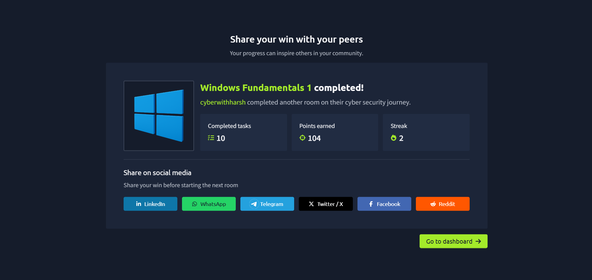

# Windows Fundamentals 1

## 📌 Lab Information

| Information | Details |
|---|---|
| Platform | TryHackMe |
| Lab | Windows Fundamentals 1 |
| Category | Windows Fundamentals / Blue Team Foundations |
| Difficulty | [Easy] |
| Status | Completed |
| Completed | [26.08.2026] |
| Tasks | 10 |

## 🎯 About This Lab

**Windows Fundamentals 1** is a foundation-level introduction to the Windows operating system.

The lab covered the Windows desktop and graphical user interface (GUI), Windows editions, Remote Desktop Protocol (RDP), the NTFS file system, Windows directories and `System32`, user accounts and permissions, User Account Control (UAC), Settings and Control Panel, and Task Manager.

For my SOC Analyst learning path, these concepts are important because Windows endpoints are a major source of security telemetry. Before investigating suspicious activity, I need to understand what normal users, files, processes, permissions, and system components look like.

## 🧠 What I Learned

- The difference between Windows desktop editions and Windows Server.
- The basic Windows GUI, including the Desktop, Start Menu, Taskbar, Search, Task View, and Notification Area.
- How RDP provides remote access to a Windows machine.
- The difference between an AttackBox and the Windows lab machine.
- What NTFS is and why NTFS permissions matter.
- The concept of Alternate Data Streams (ADS).
- The purpose of `%windir%` and the `System32` directory.
- The difference between Administrator and Standard User accounts.
- How user profiles are stored under `C:\Users`.
- How local users and groups can be managed with `lusrmgr.msc`.
- How group membership can affect effective access.
- How User Account Control (UAC) controls privilege elevation.
- The difference between Windows Settings and Control Panel.
- How Programs and Features can provide basic installed-software information.
- How Task Manager provides basic visibility into running processes and resource usage.
- Why an indicator such as high CPU usage or an ADS is not automatically proof of malicious activity.

## 🛠️ Skills Practiced

- Windows endpoint navigation
- Basic Windows administration
- RDP-based remote access
- NTFS and permission concepts
- User and group management concepts
- Privilege and UAC concepts
- Basic process identification
- Basic endpoint troubleshooting
- Security-focused Windows observation

## 🔐 SOC / Cybersecurity Relevance

This lab provides the foundation for later Windows security investigations.

A SOC Analyst may need to investigate:

- Authentication and RDP activity
- User accounts and group membership
- Privilege elevation
- Suspicious processes
- Executable paths
- File and directory activity
- Installed software
- Network configuration
- Windows Event Logs
- Endpoint Detection and Response (EDR) telemetry
- Security Information and Event Management (SIEM) alerts

A useful investigation mindset from this lab is:

```text
User
  ↓
Account / Group Membership
  ↓
Permissions / Privilege
  ↓
Process Execution
  ↓
File / Registry / Network Activity
  ↓
Windows Telemetry
  ↓
Detection
  ↓
Investigation
```

## 📚 Documentation

- [Personal Learning Notes](Notes.md)
- [Step-by-Step Walkthrough](Walkthrough.md)
- [Screenshots](Screenshots/)
- [Completion Certificate](Certificate/)

## 🔗 Original Lab

[https://tryhackme.com/room/windowsfundamentals1xbx]

## ✍️ Medium Article

Coming soon.

## 🔗 LinkedIn Post

Coming soon.

## 💡 Key Takeaways

1. Windows fundamentals are the foundation for Windows endpoint investigation.
2. Administrator does not mean every process is automatically running with elevated privileges.
3. NTFS permissions and group membership affect what users can access or modify.
4. `System32` contains important Windows components, but a file path alone is not enough to prove that a process is legitimate.
5. RDP is a legitimate administration protocol that can also be abused.
6. Task Manager is useful for initial endpoint visibility, but a SOC investigation requires additional telemetry and context.
7. A suspicious indicator is not automatically proof of malicious activity.

## 🏆 Completion Certificate



If the certificate has not yet been added, replace the image with:
