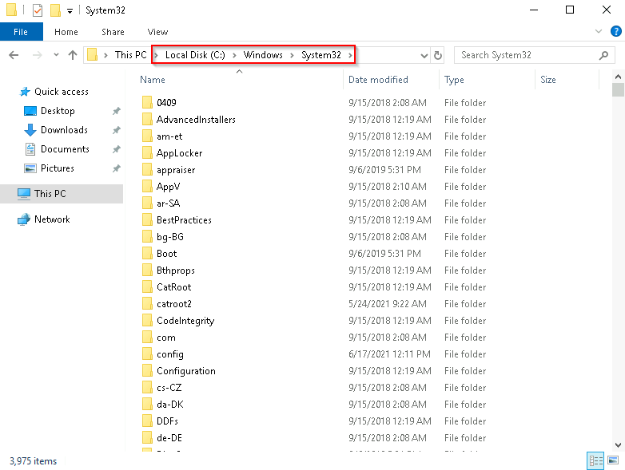
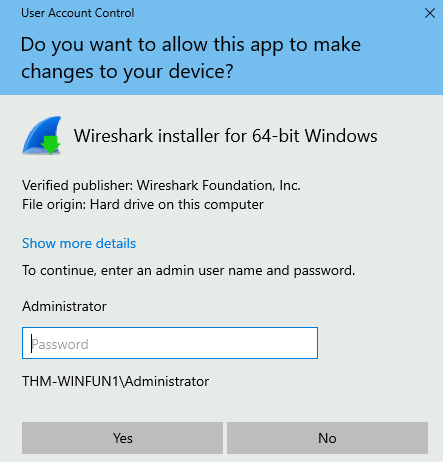
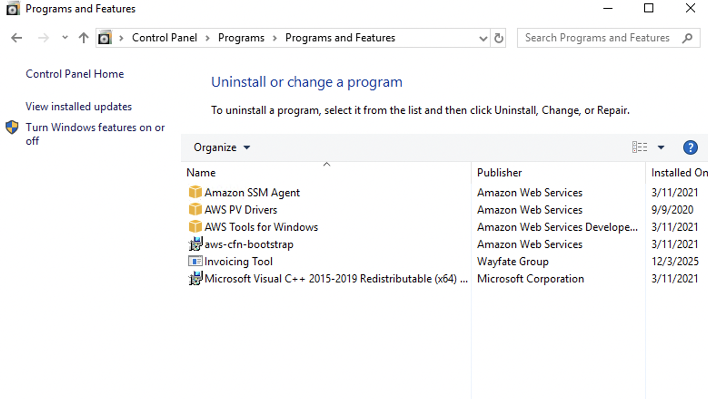
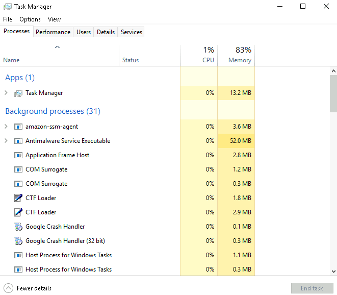

# Windows Fundamentals 1 — Step-by-Step Walkthrough

## 📌 Lab Overview

**Platform:** TryHackMe  
**Lab:** Windows Fundamentals 1  
**Status:** Completed  
**Tasks:** 10

This walkthrough documents the practical flow of the Windows Fundamentals 1 lab and separates the **actions performed**, **observations**, **explanations**, and **SOC relevance**.

The walkthrough does not include lab credentials or other sensitive information.


---

# Task 1 — Windows Editions

## 🎯 Objective

Understand the different Windows environments introduced by the lab and recognize the difference between desktop Windows and Windows Server.

## Step 1 — Review Windows Editions

The lab introduced Windows editions such as:

- Windows Home
- Windows Pro
- Windows Server

The Windows virtual machine used for the room was:

```text
Windows Server 2019 Standard
```

## 🔎 Observation

The lab environment is a Windows Server system rather than a normal consumer desktop installation.

## 🧠 Explanation

Windows editions provide different capabilities and are intended for different use cases.

Windows Server is designed for infrastructure and server workloads, while desktop editions are intended primarily for end-user workstations.

## ✅ Result

I identified the lab environment as **Windows Server 2019 Standard** and understood the basic distinction between desktop and server Windows environments.

## 🛡️ SOC Relevance

An analyst should identify the operating system and version during endpoint investigation because the platform affects available security features, tools, logs, and system behavior.

---

# Task 2 — The Desktop (GUI)

## 🎯 Objective

Become familiar with the Windows graphical interface and its major components.

## Step 1 — Inspect the Windows Desktop

After accessing the Windows machine, I reviewed the desktop and the major Windows GUI components.

Important components included:

- Desktop
- Start Menu
- Search
- Task View
- Taskbar
- Toolbars
- Notification Area


## 🔎 Observation

The Windows Desktop provides the main graphical workspace after authentication.

The Taskbar provides access to applications and system functions, while the Start Menu provides access to applications, settings, user functions, and power options.

## 🧠 Explanation

GUI means **Graphical User Interface**.

The GUI is the interaction layer between the user and the Windows operating system.

For security work, it is important to distinguish the visible GUI from the underlying activity it represents.

For example:

```text
GUI Action
    ↓
Windows Operation
    ↓
Process / File / Registry / Network Activity
    ↓
Logs / Telemetry
```

## ✅ Result

I became familiar with the basic Windows desktop environment and its main interface components.

## 🛡️ SOC Relevance

The GUI is useful for basic endpoint navigation, but a SOC Analyst eventually needs to investigate the underlying processes, accounts, files, network activity, and logs.

---

# Task 3 — Introduction to Windows

## 🎯 Objective

Understand the Windows lab environment and how the Windows machine can be accessed remotely.

## Step 1 — Identify the Lab Machine

The room separates the working environment from the Windows system being studied.

```text
AttackBox
    ↓
Network
    ↓
Windows Lab Machine
```

## 🔎 Observation

The AttackBox and Windows lab machine have different purposes.

The AttackBox acts as a working/analyst environment, while the Windows machine is the target system being studied.

## 🧠 Explanation

Understanding the environment is important because security investigations often involve an analyst workstation communicating with a target endpoint.

---

## Step 2 — Connect Using RDP

The Windows machine can be accessed using:

```text
RDP
```

**RDP = Remote Desktop Protocol**

The basic connection concept is:

```text
Analyst / Client
      ↓
     RDP
      ↓
Windows Machine
```

## 🔎 Observation

A successful RDP connection provides a remote graphical Windows session.

The lab credentials were used only for the controlled TryHackMe environment.

**Do not publish those credentials in this repository.**

## 🧠 Explanation

RDP is a legitimate Windows remote administration protocol.

It is not inherently malicious, but attackers can abuse remote-access protocols.

## ✅ Result

I accessed the Windows lab environment remotely and worked inside the Windows session.

## 🛡️ SOC Relevance

RDP activity can become important during investigations.

A SOC Analyst may need to determine:

- Which account logged in
- Where the connection originated
- When it happened
- Whether it was authorized
- What activity occurred after login

---

# Task 4 — The File System

## 🎯 Objective

Understand the Windows file system, NTFS permissions, and Alternate Data Streams.

## Step 1 — Understand NTFS

**NTFS = New Technology File System**

The Windows environment uses NTFS for common filesystem operations.

NTFS provides features such as:

- File/folder permissions
- Journaling
- Encryption through EFS
- Alternate Data Streams

## 🔎 Observation

NTFS is more than simple file storage. It provides security and filesystem functionality used by Windows.

## 🧠 Explanation

NTFS permissions determine what users and groups can do with files and folders.

Common permission concepts include:

- Full Control
- Modify
- Read & Execute
- List Folder Contents
- Read
- Write

## 🛡️ SOC Relevance

Permissions matter when investigating:

- Unauthorized file access
- Account compromise
- Privilege escalation
- Access-control issues

---

## Step 2 — Understand NTFS Permissions

The basic permission model is:

```text
User
  │
  ├── Direct Permissions
  │
  └── Group Membership
          │
          ↓
    Group Permissions
          │
          ↓
     Effective Access
```

## 🔎 Observation

Users can receive permissions directly or through group membership.

## 🧠 Explanation

Group-based permissions make Windows administration easier and are important when determining what a compromised account can access.

## ✅ Result

I understood the basic purpose of NTFS permissions and the relationship between users, groups, and effective access.

---

## Step 3 — Understand Alternate Data Streams

**ADS = Alternate Data Streams**

NTFS can associate additional data streams with a file.

Conceptually:

```text
file.txt
   │
   ├── Main data stream
   │
   └── Alternate Data Stream
```

## 🔎 Observation

ADS can exist without appearing as a normal separate file in the usual Windows file view.

## 🧠 Explanation

ADS is a legitimate NTFS feature, but it can also be abused to hide data.

Therefore:

```text
ADS detected
    ↓
Investigate context
```

It should not automatically be treated as malware.

## ✅ Result

I learned what ADS is and why it can be relevant during security investigations.

## 🛡️ SOC Relevance

ADS can become relevant during endpoint and forensic investigations where hidden or unusual filesystem data needs to be examined.

---

# Task 5 — Windows\System32

## 🎯 Objective

Understand the Windows installation directory, `%windir%`, and the System32 directory.

## Step 1 — Understand `%windir%`

The Windows installation directory is commonly:

```text
C:\Windows
```

but Windows does not have to be installed on the C: drive.

The environment variable:

```text
%windir%
```

represents the Windows installation directory.

## 🔎 Observation

On a typical installation:

```text
%windir%
    ↓
C:\Windows
```

## 🧠 Explanation

Environment variables make Windows commands and scripts less dependent on a hard-coded installation path.

---

## Step 2 — Inspect System32

The System32 directory is:

```text
%windir%\System32
```

and commonly resolves to:

```text
C:\Windows\System32
```



## 🔎 Observation

System32 contains important Windows operating-system files, executables, libraries, and utilities.

## 🧠 Explanation

System32 is a critical Windows directory.

It should be inspected carefully and not modified destructively.

A process path such as:

```text
C:\Windows\System32\example.exe
```

is useful evidence, but the path alone does not prove that the executable is legitimate.

## ✅ Result

I identified the Windows directory and understood the purpose of `%windir%` and System32.

## 🛡️ SOC Relevance

Executable paths are useful during process investigation.

A SOC Analyst should correlate the path with:

```text
Process
   ↓
Executable
   ↓
Path
   ↓
Command Line
   ↓
Parent Process
   ↓
User
   ↓
Network Activity
```

---

# Task 6 — User Accounts, Profiles, and Permissions

## 🎯 Objective

Understand Windows account types, user profiles, local groups, and permissions.

## Step 1 — Understand Account Types

The lab introduced:

- Administrator
- Standard User

## 🔎 Observation

Administrator accounts have greater privileges than Standard Users.

## 🧠 Explanation

Different privilege levels reduce the amount of system access available to a user.

```text
Administrator
     ↓
Higher privileges

Standard User
     ↓
More restricted privileges
```

## 🛡️ SOC Relevance

Account privilege is important during:

- Account compromise investigations
- Privilege escalation investigations
- Unauthorized administrative activity
- Lateral movement investigations

---

## Step 2 — Understand User Profiles

Windows user profiles are normally stored under:

```text
C:\Users
```

A profile may contain:

```text
Desktop
Documents
Downloads
Music
Pictures
```

## 🔎 Observation

User-specific files and activity can exist inside the user's profile directory.

## 🧠 Explanation

A user's profile provides a location for user-specific data and settings.

## 🛡️ SOC Relevance

User profile locations can contain artifacts useful during endpoint investigations.

---

## Step 3 — Open Local Users and Groups

The local account/group management console can be opened with:

```text
lusrmgr.msc
```


## 🔎 Observation

The console contains:

```text
Users
Groups
```

## 🧠 Explanation

Windows can manage permissions and privileges through groups.

A user can belong to multiple groups.

Example:

```text
User
 │
 ├── Users
 ├── Remote Desktop Users
 └── AnotherGroup
```

## ✅ Result

I learned how local users and groups are represented and why group membership matters.

## 🛡️ SOC Relevance

When investigating a potentially compromised account, identify:

- Username
- Account type
- Group membership
- Effective privileges

---

# Task 7 — User Account Control

## 🎯 Objective

Understand User Account Control and the concept of privilege elevation.

## Step 1 — Understand UAC

**UAC = User Account Control**

UAC is a Windows security mechanism that helps control privilege elevation.

## 🔎 Observation

An Administrator account does not mean every process automatically runs with full administrative privileges.

## 🧠 Explanation

The basic relationship is:

```text
Administrator Account
        │
        ├── Normal Activity
        │
        └── Privileged Operation
                ↓
             UAC
                ↓
             Elevation
```

---

## Step 2 — Understand the UAC Shield

Windows may display a UAC shield on actions that require elevation.

## 🔎 Observation

The shield indicates that elevated privileges may be required.

## 🧠 Explanation

A UAC shield does not mean an application is malicious.

Legitimate applications can require administrative privileges.

---

## Step 3 — Observe the UAC Prompt

The lab demonstrates the UAC prompt used when elevation is required.



## 🔎 Observation

The prompt requests approval or credentials depending on the user's privilege context.

## 🧠 Explanation

UAC helps prevent applications from silently receiving elevated privileges.

However:

> UAC is not antivirus and does not automatically prevent malware.

## ✅ Result

I understood the relationship between account privileges, process privileges, and UAC elevation.

## 🛡️ SOC Relevance

When investigating suspicious software, a SOC Analyst may need to determine:

- Which account launched the process
- Whether elevation was requested
- Whether elevation succeeded
- What activity followed the elevation

---

# Task 8 — Settings and the Control Panel

## 🎯 Objective

Understand the two main Windows configuration interfaces and how installed applications can be viewed.

## Step 1 — Open Windows Settings

Windows Settings provides modern configuration options.

Common areas include:

- System
- Network & Internet
- Personalization
- Accounts
- Applications
- Devices
- Updates

## 🔎 Observation

Settings is the modern Windows configuration interface.

---

## Step 2 — Understand Control Panel

Control Panel is the traditional Windows configuration interface.

Some configuration options remain available through Control Panel.

The relationship can be:

```text
Settings
   ↓
Network & Internet
   ↓
Change Adapter Options
   ↓
Control Panel
```

## 🧠 Explanation

Settings did not completely replace Control Panel.

Both interfaces can still be encountered on modern Windows systems.

---

## Step 3 — Review Installed Programs

The Control Panel path:

```text
Control Panel
     ↓
Programs
     ↓
Programs and Features
```

provides basic information about installed applications.



## 🔎 Observation

Installed applications can show information such as:

- Name
- Publisher
- Version

## 🧠 Explanation

Installed-software information can help during endpoint investigations.

However, Programs and Features is not a complete inventory of every executable, script, or portable application on a system.

## ✅ Result

I understood the difference between Settings and Control Panel and how to access basic installed-software information.

## 🛡️ SOC Relevance

During an investigation, an analyst may ask:

```text
What software is installed?
Who published it?
What version is installed?
Was it expected?
Is it authorized?
```

The answers can help determine whether further investigation is needed.

---

# Task 9 — Task Manager

## 🎯 Objective

Understand processes and basic system resource usage through Task Manager.

## Step 1 — Open Task Manager

Task Manager can be opened from the Windows interface.

One method is:

```text
Right-click Taskbar
       ↓
Task Manager
```

---

## Step 2 — Switch to More Details

Task Manager may initially open in a limited view.

Select:

```text
More details
```

to access the detailed interface.



## 🔎 Observation

The detailed view provides greater visibility into running processes and system resource usage.

## 🧠 Explanation

A process is a running instance of a program.

```text
Program on Disk
      ↓
Program Executes
      ↓
Process Created
```

Task Manager can provide basic visibility into:

- Processes
- CPU
- Memory
- Applications
- Performance

---

## Step 3 — Review CPU and Memory

Task Manager can show CPU and RAM usage.

```text
CPU
 ↓
Central Processing Unit

RAM
 ↓
Random Access Memory
```

## 🔎 Observation

High resource usage can identify processes that deserve investigation.

## 🧠 Explanation

High CPU or memory usage is an **indicator**, not proof of malicious activity.

For example:

```text
High CPU
   ≠
Malware
```

Legitimate software can consume significant resources.

## 🛡️ SOC Relevance

For suspicious processes, a deeper investigation should consider:

```text
Process
   ↓
Executable Path
   ↓
Command Line
   ↓
Parent Process
   ↓
User
   ↓
Start Time
   ↓
Network Connections
   ↓
File / Registry Activity
```

Task Manager is therefore a starting point for endpoint visibility rather than a complete SOC investigation platform.

## ✅ Result

I learned how to use Task Manager to view running processes and basic resource usage.

---

# Task 10 — Conclusion and Completion

## 🎯 Objective

Review the Windows Fundamentals 1 material and complete the room.

## Step 1 — Review the Main Concepts

The lab introduced:

```text
Windows Editions
Windows GUI
RDP
NTFS
NTFS Permissions
ADS
System32
User Accounts
User Profiles
Groups
UAC
Settings
Control Panel
Task Manager
Processes
```

## Step 2 — Confirm Completion

The room was completed successfully.


## 🔎 Observation

The completion screen provides evidence that the room was completed.

## Step 3 — Record Completion Details


## 🧠 Explanation

This lab should be treated as a foundation rather than mastery.

The concepts introduced here will be used later for:

- Windows Event Logs
- Windows authentication
- Process investigation
- Endpoint Detection and Response
- SIEM investigations
- Threat detection
- Incident response

## ✅ Result

Windows Fundamentals 1 is completed and documented as part of my cybersecurity/SOC Analyst learning journey.

## 🛡️ SOC Relevance

The most important outcome is understanding the Windows endpoint as a collection of:

```text
Users
   +
Files
   +
Processes
   +
Permissions
   +
System Components
   +
Configuration
   +
Security Controls
```

Later, these components become sources of security telemetry.

---

# 📸 Screenshot Plan

| # | Filename | Where to Add | What to Capture |
|---|---|---|---|
| 01 | `01-windows-fundamentals-task-list.png` | Lab Overview | TryHackMe Windows Fundamentals 1 task list / room overview |
| 02 | `02-windows-fundamentals-completed.png` | Task 10 → Step 2 | TryHackMe completion screen showing the room was completed |
| 03 | `03-windows-fundamentals-completion-details.png` | Task 10 → Step 3 | Completion/details screen with non-sensitive information |
| 04 | `04-windows-desktop-gui.png` | Task 2 → Step 1 | Windows desktop showing the GUI, Taskbar, Start area, and system tray |
| 05 | `05-windows-system-directory.png` | Task 5 → Step 2 | File Explorer showing `%windir%\System32` or the Windows System32 directory |
| 06 | `06-user-accounts-and-groups.png` | Task 6 → Step 3 | Local Users and Groups console showing Users/Groups |
| 07 | `07-uac-prompt.png` | Task 7 → Step 3 | UAC prompt demonstrating privilege elevation; redact credentials or sensitive data |
| 08 | `08-installed-programs.png` | Task 8 → Step 3 | Programs and Features / installed applications showing name, publisher, and version |
| 09 | `09-task-manager-processes.png` | Task 9 → Step 2 | Task Manager in More Details view showing processes and resource information |

## 🚨 Screenshot Safety

Before committing screenshots to GitHub, verify that they do not expose:

- Passwords
- API keys
- Tokens
- Private credentials
- Personal information
- Private infrastructure information
- VPN credentials
- Secrets
- Restricted flags
- Any content prohibited by TryHackMe

Redact sensitive information before publication.

## 📁 Screenshot Naming Rule

Use lowercase kebab-case and number screenshots in the order they appear in the walkthrough.

Example:

```text
01-windows-fundamentals-task-list.png
02-windows-fundamentals-completed.png
03-windows-fundamentals-completion-details.png
04-windows-desktop-gui.png
05-windows-system-directory.png
06-user-accounts-and-groups.png
07-uac-prompt.png
08-installed-programs.png
09-task-manager-processes.png
```

---

# 🏆 Certificate

Use this exact filename:

```text
Certificate/windows-fundamentals-1-certificate.png
```

If the certificate is not available yet, leave the file out until you have the real certificate and keep the placeholder in `README.md`.

---

# 🔗 Documentation Links

Original TryHackMe lab:

```text
[ADD LAB LINK]
```

Medium article:

```text
Coming soon.
```

LinkedIn post:

```text
Coming soon.
```
